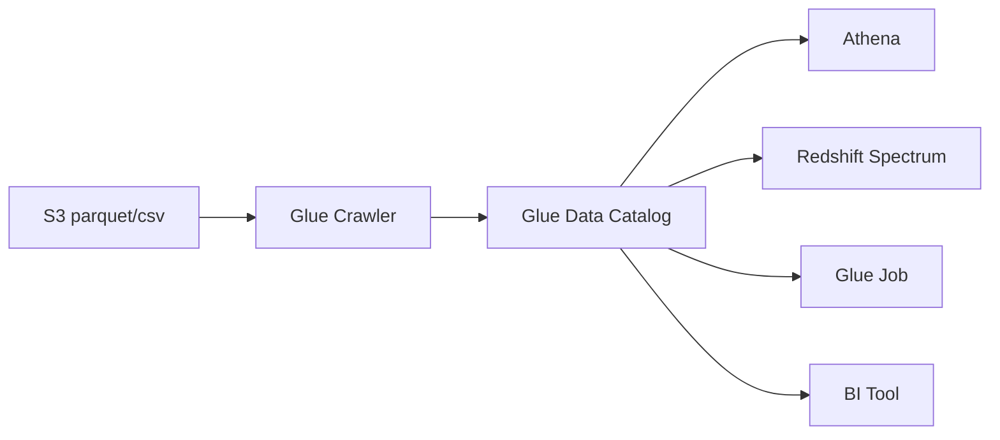

# Redshift

> **หมายเหตุที่มา:** โน้ตนี้เป็น **ความรู้ทั่วไปเรื่อง AWS Redshift** ไม่ได้มาจากเอกสารหรือการทดสอบของ COM7 — เขียนไว้เป็นคู่มือตั้งต้นตอนจะเริ่มใช้จริง **ตัวเลขค่าใช้จ่ายยังไม่ได้ยืนยัน** ส่วนที่โยงกับ COM7 กำกับ `[อนุมาน]` ไว้
>
> ส่วน **ความพร้อมของ region ตรวจแล้ว 2026-09-02** จาก [เอกสาร endpoint ของ AWS](https://docs.aws.amazon.com/general/latest/gr/redshift-service.html)

**สถานะ: ยังไม่ได้ตัดสินใจใช้** — [[Architecture]] วาง `Athena / Redshift` ไว้ในชั้น consumption แต่ยังไม่มีข้อสรุปว่าจะใช้ตัวไหนหรือทั้งคู่

---

## Redshift คืออะไร ต่างจาก Athena ตรงไหน

**Data warehouse** — เก็บข้อมูลไว้ในตัวเองในรูปแบบ columnar แล้ว query ด้วย SQL

| | [[Athena Benchmark\|Athena]] | Redshift |
|---|---|---|
| ข้อมูลอยู่ไหน | S3 เสมอ | ในตัว Redshift หรือ S3 (ผ่าน Spectrum) |
| ตั้งค่า | ไม่มีอะไรให้ตั้ง | Namespace + Workgroup + VPC |
| คิดเงิน | $5/TB ที่ scan · ไม่ใช้ = 0 | RPU-ชั่วโมง + storage |
| เร็วเมื่อ | query นาน ๆ ครั้ง | **query ซ้ำ ๆ ถี่ ๆ · join หนัก · dashboard** |
| อ่าน Glue Catalog | ได้ | ได้ ผ่าน Spectrum |

**ทั้งคู่อ่าน Glue Data Catalog ตัวเดียวกัน** — Crawler ที่ทำไว้แล้วใช้ได้กับทั้งสองตัว ไม่ต้องทำใหม่

---

## Serverless หรือ Provisioned

| | **Serverless** | Provisioned |
|---|---|---|
| เหมาะกับ | เริ่มต้น · โหลดไม่สม่ำเสมอ | รู้ workload แน่ชัด · รัน 24 ชม. |
| คิดเงิน | ตาม RPU-ชั่วโมงที่ใช้จริง · idle = หยุดคิด | ตามขนาด cluster ตลอดเวลา |
| ต้องเลือกขนาดเครื่อง | ไม่ต้อง | ต้อง (node type · จำนวน node) |
| ที่ ap-southeast-7 | **มี** | **มี** |

### ความพร้อมที่ ap-southeast-7 — ตรวจแล้ว 2026-09-02

เอกสาร endpoint ของ AWS ระบุ ap-southeast-7 ครบทั้ง 4 รายการ

| API | Endpoint |
|---|---|
| Redshift (provisioned) | `redshift.ap-southeast-7.amazonaws.com` |
| Redshift Serverless | `redshift-serverless.ap-southeast-7.amazonaws.com` |
| Redshift Data API | `redshift-data.ap-southeast-7.amazonaws.com` |
| Query Editor v2 | `api.sqlworkbench.ap-southeast-7.amazonaws.com` |

AWS ประกาศ Redshift Serverless พร้อมใช้ที่ไทยตั้งแต่ **มี.ค. 2025**

**แปลว่าไม่ติดข้อกำหนด PDPA ที่ service ต้องอยู่ไทย** → [[AWS Services]] · [[Consent & PDPA]]

> ⚠️ มี endpoint ไม่ได้แปลว่า **node type ของ provisioned ครบทุกรุ่น** — region ใหม่มักเปิด RA3 ก่อนและไม่มี DC2 ต้องดูในหน้า Console ตอนสร้างจริง `[อนุมาน]`

**เริ่มด้วย Serverless** — ไม่ต้องเดาขนาด ไม่ใช้ก็ไม่เสียเงิน และไม่ต้องลุ้นเรื่อง node type ที่ region นี้รองรับ

**ที่มา:** [AWS Redshift endpoints and quotas](https://docs.aws.amazon.com/general/latest/gr/redshift-service.html) · [Redshift Serverless available in Thailand](https://aws.amazon.com/about-aws/whats-new/2025/03/amazon-redshift-serverless-available-mexico-thailand/)

---

## ขั้นตอนตั้งค่าครั้งแรก

### 1 · สร้าง IAM Role ก่อนเสมอ

Redshift ต้องมี role ไปหยิบของจาก S3 และอ่าน Glue Catalog

```
Trusted entity : Redshift - Customizable
```

policy แบบจำกัดขอบเขต ปลอดภัยกว่า managed policy:

```json
{
  "Version": "2012-10-17",
  "Statement": [
    {
      "Effect": "Allow",
      "Action": ["s3:GetObject", "s3:ListBucket"],
      "Resource": [
        "arn:aws:s3:::com7-lake",
        "arn:aws:s3:::com7-lake/*"
      ]
    },
    {
      "Effect": "Allow",
      "Action": ["glue:GetDatabase*", "glue:GetTable*", "glue:GetPartition*"],
      "Resource": "*"
    }
  ]
}
```

### 2 · สร้าง Namespace

**Namespace = ที่เก็บข้อมูล** — database · ผู้ใช้ · snapshot · IAM role

```
Namespace name    : com7-datalake
Database name     : dev
Admin credentials : เก็บใน Secrets Manager ไม่ใช่ในเอกสาร
IAM roles         : แนบ role จากข้อ 1 แล้วตั้งเป็น Default
Encryption        : เปิด KMS
```

### 3 · สร้าง Workgroup

**Workgroup = ที่ประมวลผล** — RPU · เครือข่าย · security group

```
Workgroup name : com7-wg
Base capacity  : 8 RPU        เริ่มต่ำสุดก่อน ปรับขึ้นทีหลังได้
VPC / Subnet   : อย่างน้อย 3 subnet ต่างกัน 3 AZ
Security group : เปิด port 5439 เฉพาะต้นทางที่จำเป็น
Public access  : ปิด — ถ้าต่อจากนอก VPC ให้ผ่าน VPN
```

แยก Namespace กับ Workgroup ออกจากกันเพื่อให้ **ปรับกำลังประมวลผลได้โดยไม่แตะข้อมูล**

> การต่อผ่าน VPN เกี่ยวกับงานที่ค้างอยู่ใน [[Network & VPN]]

### 4 · เปิด Query Editor v2

อยู่ในเมนู Redshift — **ทำงานบนเบราว์เซอร์ ไม่ต้องลง client** และไม่ต้องผ่าน VPN เพราะวิ่งผ่าน AWS API ไม่ใช่ port 5439

```sql
CREATE SCHEMA IF NOT EXISTS bronze;
CREATE SCHEMA IF NOT EXISTS silver;
CREATE SCHEMA IF NOT EXISTS gold;
```

> เกี่ยวกับคำถามที่ค้างกับทีม AWS เรื่อง "มี service ไหนทดแทน SSMS ได้" → [[AWS Services]] `[อนุมาน: Query Editor v2 ตอบโจทย์เฉพาะฝั่ง Redshift ไม่ใช่ฐานต้นทาง]`

---

## สิทธิ์ — ตรวจและแก้ยังไง

> **จากการทำจริง 2026-09-03** บน namespace ของทีม — ไล่ error มาจนใช้งานได้

### สิทธิ์มี 2 ชั้นที่แยกกันคนละเรื่อง

| ชั้น | คุมอะไร | ตั้งที่ไหน |
|---|---|---|
| **IAM** | Redshift ไปหยิบของจาก S3 / Glue ได้ไหม · ใครเปิด Query Editor ได้ | AWS Console |
| **SQL GRANT** | ใครเห็นตารางไหน · คอลัมน์ไหน · แถวไหน | ในฐานข้อมูล |

**IAM ไม่ได้คุมว่าใครเห็นตารางอะไร** — นั่นเป็นเรื่องของ `GRANT` ล้วน ๆ

### คำสั่งตรวจสิทธิ์

```sql
-- คุณคือใคร ต่ออยู่ฐานไหน
SELECT current_user, current_database();

-- ใครเป็น superuser บ้าง
SELECT usename, usesuper, usecreatedb FROM pg_user ORDER BY usename;

-- มีสิทธิ์บน database จริงไหม
SELECT HAS_DATABASE_PRIVILEGE('IAM:someone@comseven.com', 'dev', 'CREATE');

-- สิทธิ์บนตาราง / role ที่ได้รับ
SELECT * FROM SVV_RELATION_PRIVILEGES WHERE namespace_name = 'silver';
SELECT * FROM SVV_USER_GRANTS;
SELECT * FROM SVV_ROLE_GRANTS;
SELECT HAS_TABLE_PRIVILEGE('IAM:someone@comseven.com', 'silver.contracts', 'SELECT');
```

### ⚠️ `pg_user` ไม่แสดงผลของ `GRANT`

คอลัมน์ `usesuper` / `usecreatedb` เป็นคุณสมบัติของ **ตัว user** จะไม่เปลี่ยนจากคำสั่ง `GRANT` ต่อให้ grant สำเร็จ

**ต้องเช็คด้วย `HAS_DATABASE_PRIVILEGE` เท่านั้น** — เสียเวลาไปหลายรอบเพราะดูผิดที่

### ลำดับ error ที่เจอจริงตอนทำ `CREATE EXTERNAL SCHEMA`

| # | Error | สาเหตุ | แก้ |
|---|---|---|---|
| 1 | `permission denied for database dev` | user ที่ล็อกอินไม่ใช่ superuser และไม่มี `CREATE` บน `dev` | superuser รัน `GRANT CREATE ON DATABASE dev TO "..."` |
| 2 | **`permission denied for database dev` (ยังเหมือนเดิม)** | **`GRANT CREATE ON DATABASE` ไม่พอสำหรับ `CREATE EXTERNAL SCHEMA`** | superuser ให้ `ALTER USER ... CREATEDB` เพิ่ม หรือสร้าง schema ให้เลย |
| 3 | `permission denied for database awsdatacatalog` | ต้องมีสิทธิ์บน Glue Catalog ที่ Redshift mount เข้ามา | `GRANT USAGE ON DATABASE awsdatacatalog TO "..."` |
| 4 | `Parsed manifest is not a valid JSON object` | ไม่ใช่เรื่องสิทธิ์แล้ว — นิยามตารางใน Glue ชี้ผิดที่ | → [[Glue Crawler]] |

**ชื่อ user ต้องครอบด้วยเครื่องหมายคำพูดคู่เสมอ** เพราะมี `:` `@` `.` และตัวพิมพ์ใหญ่ ถ้าไม่ใส่ Redshift แปลงเป็นตัวพิมพ์เล็กแล้วหา user ไม่เจอ

```sql
GRANT USAGE ON DATABASE awsdatacatalog TO "IAM:sapon.s@comseven.com";
```

### `awsdatacatalog` คืออะไร

Redshift Serverless **mount Glue Data Catalog เข้ามาเป็น database ชื่อ `awsdatacatalog` ให้อัตโนมัติ** (auto-mount) ไม่ใช่ database ที่เราสร้าง

**แปลว่าอาจไม่ต้อง `CREATE EXTERNAL SCHEMA` เลย** — query ด้วยชื่อ 3 ส่วนได้ตรง ๆ

```sql
GRANT USAGE ON DATABASE awsdatacatalog TO "IAM:sapon.s@comseven.com";

SELECT * FROM awsdatacatalog.default.ชื่อตาราง LIMIT 10;
--            └ Glue Catalog  └ Glue db  └ ตารางจาก Crawler
```

| | auto-mount | `CREATE EXTERNAL SCHEMA` |
|---|---|---|
| ต้องสร้างอะไร | ไม่ต้อง | ต้อง |
| Glue database ใหม่ | เห็นทันที | ต้องสร้าง schema เพิ่มทุกครั้ง |
| สิทธิ์ที่ต้องขอ | `USAGE ON DATABASE awsdatacatalog` | + `CREATE ON DATABASE dev` |

### ทางที่แนะนำเมื่อไม่ใช่ superuser

ให้ superuser **สร้างให้เลย** แล้วโอนความเป็นเจ้าของมา — จบเรื่องสิทธิ์ทั้งหมดในครั้งเดียว

```sql
CREATE EXTERNAL SCHEMA glue_schema
FROM DATA CATALOG
DATABASE 'default'
IAM_ROLE 'arn:aws:iam::603238661233:role/<redshift-role>';

GRANT USAGE ON SCHEMA glue_schema TO "IAM:sapon.s@comseven.com";
ALTER SCHEMA glue_schema OWNER TO "IAM:sapon.s@comseven.com";
```

**บรรทัดสุดท้ายสำคัญ** — หลังจากนี้เจ้าของ schema แก้ ลบ สร้างใหม่ได้เองโดยไม่ต้องเป็น superuser

> ตัด `CREATE EXTERNAL DATABASE IF NOT EXISTS` ออกได้ถ้า Glue database มีอยู่แล้ว — clause นั้นต้องการ `glue:CreateDatabase` เพิ่ม และถ้าเปิด Lake Formation ต้องมี `CREATE_DATABASE` ด้วย

### ให้สิทธิ์ที่ role ไม่ใช่ที่คน

```sql
CREATE ROLE analyst;
CREATE ROLE etl;

GRANT USAGE ON SCHEMA silver TO ROLE analyst;                  -- USAGE ก่อนเสมอ
GRANT SELECT ON ALL TABLES IN SCHEMA silver TO ROLE analyst;
GRANT ROLE analyst TO "IAM:someone@comseven.com";

-- ตารางใหม่ที่ etl สร้าง ให้สิทธิ์อัตโนมัติ
ALTER DEFAULT PRIVILEGES FOR USER etl IN SCHEMA silver
  GRANT SELECT ON TABLES TO ROLE analyst;
```

| กติกา | เหตุผล |
|---|---|
| **`USAGE ON SCHEMA` ก่อน `SELECT` เสมอ** | ไม่มี USAGE ต่อให้ grant ตารางแล้วก็ยังมองไม่เห็น — สาเหตุอันดับ 1 ที่คนบ่นว่า "ให้สิทธิ์แล้วแต่ query ไม่ได้" |
| **ตั้ง `ALTER DEFAULT PRIVILEGES` ตั้งแต่วันแรก** | `GRANT ... ON ALL TABLES` ให้สิทธิ์เฉพาะตารางที่มีอยู่ ณ ตอนนั้น ตารางใหม่ไม่ได้ตามไปด้วย |
| **`FOR USER` ต้องเป็นคนที่สร้างตารางจริง** | default privileges ผูกกับ**คนสร้าง** ไม่ใช่ schema ใส่ผิดคนจะไม่มีผลและไม่มี error เตือน |
| **external schema ให้แค่ `USAGE`** | ตาราง external grant รายตัวไม่ได้ สิทธิ์อ่านไฟล์จริงมาจาก IAM role ที่ผูกกับ namespace |

### เรื่อง superuser

```sql
ALTER USER "IAM:someone@comseven.com" CREATEUSER;   -- → usesuper = true
ALTER USER "IAM:someone@comseven.com" CREATEDB;     -- → usecreatedb = true
ALTER USER "IAM:someone@comseven.com" NOCREATEUSER; -- ถอนคืน
```

`CREATEUSER` คือคีย์เวิร์ดที่ทำให้เป็น **superuser** (ชื่อชวนเข้าใจผิด) · `CREATEDB` เป็นคนละตัว

**superuser ข้าม RLS และ masking policy ทั้งหมด** — ถ้าทีมทำ masking เลขบัตรประชาชนไว้ บัญชี superuser จะเห็นค่าจริงเสมอ และ audit log แยกไม่ออกว่าเป็นงานตั้งค่าหรืองาน query ข้อมูลลูกค้า → [[Consent & PDPA]]

**ทางที่ดีกว่า:** ยกให้ชั่วคราว → สร้างของที่ต้องการ → `ALTER SCHEMA ... OWNER TO` → ถอน superuser คืน

### Query Editor v2 จำกัด 3 connection ต่อคน

```
The current limit of 3 connections has been reached.
```

เจอบ่อยตอนไล่แก้สิทธิ์เพราะต้อง reconnect หลายรอบ

| แก้ | วิธี |
|---|---|
| ปิดแท็บ editor ที่ไม่ใช้ | แต่ละแท็บที่เปิด **Isolated session** = 1 connection |
| ปิด **Isolated session** | สวิตช์มุมขวาบนของแท็บ — เปิดไว้เฉพาะตอนต้องใช้ temp table |
| Refresh / logout-login | ปล่อย connection ที่ค้าง |
| เพิ่มเพดาน | Settings → Account settings → Max concurrent connections (ต้องเป็น admin) |

> **สิทธิ์ระดับ user attribute อ่านตอนเปิด session** — หลัง `ALTER USER` ต้อง reconnect ถึงจะเห็นผล

---

## นำข้อมูลจาก S3 เข้ามา — 3 ทาง

| | วิธี | ข้อมูลอยู่ไหน | เหมาะกับ |
|---|---|---|---|
| **A** | `COPY` | ย้ายเข้า Redshift | ตารางที่ query บ่อย ต้องการเร็วสุด |
| **B** | **Spectrum** | คาอยู่บน S3 | ข้อมูลดิบ · ใหญ่ · นาน ๆ query ที |
| **C** | `COPY JOB` | ย้ายเข้าอัตโนมัติ | มีไฟล์ใหม่ลง S3 เรื่อย ๆ |

### A · COPY จาก CSV

```sql
CREATE TABLE bronze.leads_ev7 (
    lead_id       VARCHAR(64),
    customer_name VARCHAR(300),
    address       VARCHAR(1500),
    phone         VARCHAR(60),
    created_date  DATE
);

COPY bronze.leads_ev7
FROM 's3://google-sheet-extract/google-sheet-ev7/leads-ev7-2026.csv'
IAM_ROLE 'arn:aws:iam::603238661233:role/RedshiftS3Role'
FORMAT AS CSV
IGNOREHEADER 1
DELIMITER ','
BLANKSASNULL
EMPTYASNULL
DATEFORMAT 'auto'
TIMEFORMAT 'auto'
ACCEPTINVCHARS
MAXERROR 100;
```

| ตัวเลือก | ทำอะไร |
|---|---|
| `IGNOREHEADER 1` | ข้ามบรรทัดหัวตาราง |
| `BLANKSASNULL` `EMPTYASNULL` | ช่องว่างกลายเป็น NULL ไม่ใช่ string ว่าง |
| `ACCEPTINVCHARS` | อักขระที่แปลงไม่ได้แทนที่ด้วย `?` แทนที่จะล้มทั้ง job |
| `MAXERROR 100` | ยอมให้แถวเสียได้ 100 แถวก่อนหยุด |

### A · COPY จาก Parquet

```sql
COPY silver.sales
FROM 's3://com7-lake/silver/sales/'
IAM_ROLE 'arn:aws:iam::603238661233:role/RedshiftS3Role'
FORMAT AS PARQUET;
```

**ไม่ต้องระบุ delimiter · header · dateformat เลย** เพราะ Parquet มี schema และชนิดข้อมูลฝังอยู่ในไฟล์แล้ว — เหตุผลเดียวกับที่ Crawler เดา type ผิดกับ Parquet ไม่ได้

### C · COPY JOB — ไฟล์ใหม่ไหลเข้าเอง

```sql
COPY bronze.leads_ev7
FROM 's3://google-sheet-extract/google-sheet-ev7/'
IAM_ROLE 'arn:aws:iam::603238661233:role/RedshiftS3Role'
FORMAT AS CSV IGNOREHEADER 1
JOB CREATE load_leads_ev7 AUTO ON;
```

ตั้งครั้งเดียว หลังจากนั้นไฟล์ใหม่ที่ [[Google Sheet to S3 (Lambda)|Lambda เขียนลง S3]] จะเข้า Redshift เอง ไม่ต้องเขียนโค้ดเพิ่ม `[อนุมาน: ยังไม่ได้ทดสอบกับ pipeline จริง]`

---

## ⚠️ กับดักภาษาไทย — VARCHAR นับเป็น byte

**`VARCHAR(n)` ของ Redshift นับ byte ไม่ใช่ตัวอักษร**

```
ภาษาไทย 1 ตัวอักษร = 3 bytes ใน UTF-8

VARCHAR(30)  เก็บภาษาไทยได้  10 ตัวอักษร
VARCHAR(100) เก็บได้        ~33 ตัวอักษร
VARCHAR(400) เก็บได้       ~133 ตัวอักษร
```

**ตั้งเผื่อ 3–4 เท่าของจำนวนตัวอักษรที่ต้องการเสมอ** — ที่อยู่คนไทย 100 ตัวอักษรต้องใช้ `VARCHAR(400)` ขึ้นไป

ถ้าไม่พอจะเจอ `String length exceeds DDL length` และถ้าใส่ `TRUNCATECOLUMNS` เพื่อให้ผ่าน **ข้อมูลจะถูกตัดหายเงียบ ๆ**

> นี่คือกับดักเดียวกับที่ SQL union K2+ITOS ตัดที่อยู่เหลือ 30 ตัวอักษร → [[Collection Union (K2 + ITOS)]] · [[Data Standardization & Quality]]

**BOM ในไฟล์ CSV** — ไฟล์ที่เขียนด้วย `utf-8-sig` มี BOM 3 bytes นำหน้า `IGNOREHEADER 1` ข้ามไปพร้อมบรรทัดหัวตารางจึงไม่มีปัญหา แต่ถ้าไฟล์ไม่มี header BOM จะไปติดค่าแรกของแถวแรก

**ดู error ที่ COPY ล้มเหลว**

```sql
SELECT * FROM sys_load_error_detail ORDER BY start_time DESC LIMIT 20;
```

---

## B · ใช้ร่วมกับ Glue Crawler

**ใช้ร่วมกันได้ และเป็นวิธีที่ควรใช้** เพราะ Redshift Spectrum อ่าน schema จาก Glue Data Catalog โดยตรง



### ขั้นตอน

**1. สร้าง Crawler** ชี้ไปที่ S3 prefix

```
Data source     : s3://com7-lake/silver/sales/
IAM role        : AWSGlueServiceRole-com7
Target database : com7_silver
Schedule        : 23:45  (หลัง Glue job รอบ 23:30 ที่ทีมตกลง)
```

**2. Run** — Crawler สร้างตารางใน Catalog พร้อม schema และ partition

**3. ผูกเข้า Redshift ครั้งเดียว**

```sql
CREATE EXTERNAL SCHEMA spectrum_silver
FROM DATA CATALOG
DATABASE 'com7_silver'
IAM_ROLE 'arn:aws:iam::603238661233:role/RedshiftS3Role';
```

**4. query ได้เลยโดยไม่ต้องโหลด**

```sql
SELECT branch_code, SUM(amount)
FROM spectrum_silver.sales          -- ข้อมูลยังอยู่บน S3
WHERE year = 2026 AND month = 9     -- partition pruning ต้องมีเสมอ
GROUP BY branch_code;
```

**5. join ข้ามที่เก็บได้ — จุดแข็งที่สุดของ Spectrum**

```sql
SELECT c.customer_name, SUM(s.amount)
FROM   spectrum_silver.sales s        -- อยู่บน S3
JOIN   silver.customers    c          -- อยู่ใน Redshift
  ON   s.customer_id = c.customer_id
GROUP  BY 1;
```

### ข้อควรรู้เรื่อง Crawler

| | |
|---|---|
| Crawler เดา type ผิดได้ | เจอบ่อยกับ **วันที่** และ **เลขที่ขึ้นต้นด้วย 0** — ได้ `string` แทน `date` หรือ 0 หน้าหาย |
| ทางแก้ | สร้างตารางด้วย DDL เอง แล้วให้ Crawler ทำแค่เพิ่ม partition (ตั้ง schema change policy เป็น `LOG` ไม่ใช่ `UPDATE_IN_DATABASE`) |
| Parquet ปลอดภัยกว่า CSV | มี type อยู่ในไฟล์ Crawler ไม่ต้องเดา |

> [[Athena Benchmark]] วัดแล้วว่า schema แบบ Crawler partition กับ Iceberg ต่างกันไม่ถึง 9% แต่ **partition pruning ลดข้อมูลที่ scan ได้ 94%** — ตัวหลังสำคัญกว่ามาก และมีผลกับ Spectrum เหมือนกันเพราะคิดเงินตามปริมาณที่ scan `[อนุมาน]`

---

## เลือกระหว่าง COPY กับ Spectrum

| | COPY เข้า Redshift | Spectrum อ่านจาก S3 |
|---|---|---|
| ความเร็ว | เร็วกว่ามาก | ช้ากว่า |
| ค่าเก็บข้อมูล | จ่ายค่า Redshift storage | จ่ายแค่ค่า S3 |
| ค่า query | รวมใน RPU | **Serverless: รวมใน RPU · Provisioned: + $5/TB** |
| ต้อง refresh | ต้องโหลดใหม่เมื่อข้อมูลเปลี่ยน | เห็นไฟล์ใหม่ทันที |

**แนวทางที่ใช้กันทั่วไป** `[อนุมาน สำหรับ COM7]`

```
Bronze (ดิบ)    →  Spectrum            ใหญ่ นาน ๆ แตะที
Silver (สะอาด)  →  Spectrum หรือ COPY   แล้วแต่ความถี่
Gold (มาร์ท)    →  COPY เข้า Redshift   ตารางที่ dashboard ยิงทุกวัน
```

---

## ค่าใช้จ่าย — จุดที่ทีมบันทึกไว้แล้วว่าต้องระวัง

> **PoC review ของทีมบันทึกว่า Redshift Spectrum "แพงมาก"** → [[AWS Services]]

### ข้อเท็จจริงที่ตรวจแล้ว 2026-09-02 — Spectrum คิดเงินไม่เหมือนกันระหว่าง 2 โหมด

หน้า [Redshift pricing](https://aws.amazon.com/redshift/pricing/) ระบุว่า

> "Amazon Redshift Serverless queries of external data in Amazon S3 are **not billed for separately** and are included in the amount billed for Amazon Redshift Serverless in RPU-hr amounts."

| โหมด | ค่า query ข้อมูลบน S3 |
|---|---|
| **Provisioned** | **$5/TB scan แยกต่างหาก** (ขั้นต่ำ 10 MB ต่อ query) |
| **Serverless** | **รวมอยู่ใน RPU-ชั่วโมงแล้ว ไม่คิดแยก** |

**ถ้าใช้ Serverless จะไม่มีบิลต่อ TB ซ้อนเข้ามา** — ข้อสรุปว่า "แพงมาก" ใน PoC น่าจะประเมินบนฐาน provisioned `[อนุมาน — ยังไม่ได้ยืนยันกับคนที่ทำ PoC]`

**แต่ไม่ได้แปลว่าถูก** — scan เยอะ = ใช้ RPU นาน = จ่ายเยอะอยู่ดี แค่คิดคนละวิธี

### สาเหตุที่ทำให้บานปลาย

query ที่ไม่ใส่เงื่อนไข partition จะ scan ทั้ง bucket

| ต้องทำ | เพราะ |
|---|---|
| ตั้ง **Usage limit** ที่ workgroup | กัน RPU วิ่งเกินงบจาก query ที่เขียนผิด |
| ปล่อย **auto-pause** เปิดไว้ | ไม่มี query = ไม่คิดเงิน |
| ระวัง **dashboard ที่ refresh อัตโนมัติ** | ทำให้ไม่มีวัน idle = จ่ายตลอด 24 ชม. |
| **บังคับ WHERE บน partition** ทุก query ที่ยิง Spectrum | ไม่ใส่ = scan ทั้ง bucket |

---

## ฟีเจอร์ที่ควรรู้ตอนเริ่ม

| ฟีเจอร์ | ใช้ทำอะไร |
|---|---|
| **Query Editor v2** | เขียน SQL บนเบราว์เซอร์ · save · แชร์ในทีม |
| **`COPY JOB`** | ไฟล์ใหม่ลง S3 แล้วเข้า Redshift เอง |
| **Zero-ETL** | ดึงจาก Aurora/RDS เข้ามาแบบ near real-time |
| **Data Sharing** | แชร์ข้อมูลข้าม namespace/account โดยไม่ copy |
| **`SUPER` type** | เก็บ JSON ได้ตรง ๆ — น่าจะตรงกับ `pdpa_consent` ของ CRM ที่ยังไม่รู้โครงสร้าง → [[CRM - Data Dictionary]] `[อนุมาน]` |
| **Materialized View** | pre-compute งานหนัก refresh อัตโนมัติ |
| **AUTO ทุกอย่าง** | `DISTSTYLE AUTO` · `SORTKEY AUTO` · `ENCODE AUTO` — **ครั้งแรกอย่าตั้งเอง ปล่อย AUTO** |

---

## ลำดับที่แนะนำสำหรับ COM7

`[อนุมาน — ยังไม่ผ่านการตกลงกับทีม]`

1. **สร้าง Glue Crawler ก่อน** — ได้ Catalog ที่ใช้ได้กับทั้ง Athena และ Redshift
2. **ทดสอบด้วย Athena** — ไม่ต้องตั้งอะไร ไม่ใช้ก็ไม่เสียเงิน เหมาะกับช่วง survey ที่ยัง 2/11 ระบบ
3. **เปิด Redshift Serverless ต่อเมื่อ** มี dashboard ที่คนใช้ทุกวัน หรือต้อง join หลายระบบซ้ำ ๆ
4. ชี้ Spectrum ไปที่ Catalog เดิม — **ไม่ต้องทำ Crawler ใหม่**

**ตอนนี้ยังไม่มีเหตุผลชัดเจนให้เปิด Redshift** เพราะยังไม่มี dashboard ประจำและ [[Athena Benchmark]] แสดงว่า Athena รับงานปัจจุบันได้ — เรื่องที่ยังต้องหาคำตอบอยู่ที่ [[Pipeline Issues]]

---

## เชื่อมกับโน้ตอื่น

[[Architecture]] · [[AWS Services]] · [[Athena Benchmark]] · [[Glue Crawler]] · [[ETL & Spark]] · [[Google Sheet to S3 (Lambda)]] · [[Data Standardization & Quality]] · [[Network & VPN]] · [[Pipeline Issues]]
