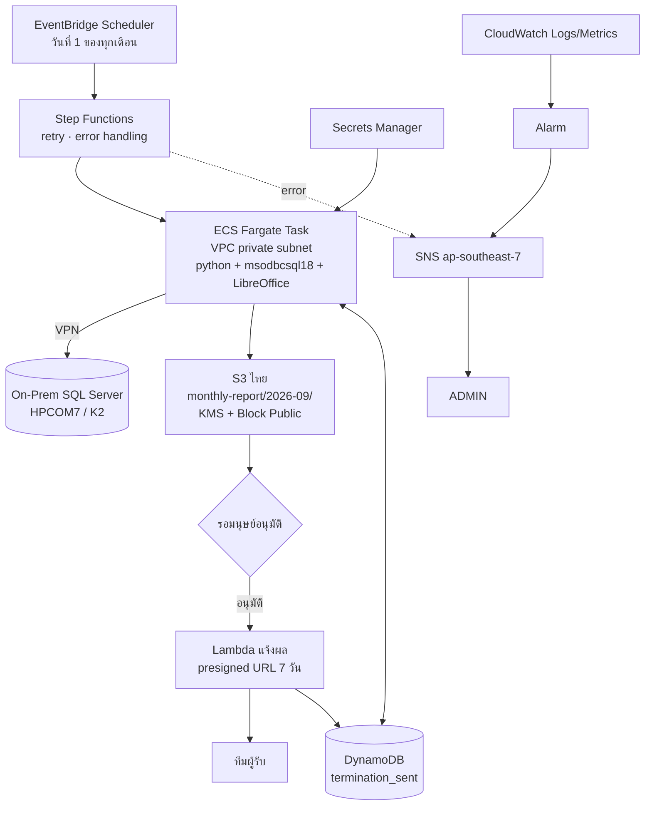

# K2 Termination Automation

> **หมายเหตุที่มา:** ผังสถาปัตยกรรมร่างโดยทีม 2026-09-03 · บทวิเคราะห์ข้อจำกัดในโน้ตนี้เป็น **ความรู้ทั่วไปเรื่อง AWS + การอ่านโค้ดจริงใน `scripts/k2/`** ไม่ได้มาจากการทดสอบบน AWS จริง — ยกเว้นเรื่องความพร้อมของ region ที่ตรวจจากเอกสาร AWS แล้ว
>
> **สถานะ: ยังเป็นข้อเสนอ ยังไม่ได้ลงมือ**

เป้าหมาย — ทำให้งานออกหนังสือบอกเลิกสัญญารายเดือนที่ตอนนี้รันด้วยมือบนเครื่อง กลายเป็นงานอัตโนมัติบน AWS

**ของเดิมที่ทำงานอยู่** → [[K2 - OD6 Selection Logic]] · [[K2 - Termination Letter How-To]]

| | |
|---|---|
| สคริปต์ | `scripts/k2/k2_termination.py` |
| SQL | `sql/k2_termination_list_v4.sql` |
| รันยังไงตอนนี้ | คนรันเองบนเครื่อง `python scripts/k2/k2_termination.py 2026-09-01` |
| ผลรอบ 9/2026 | 343 สัญญา |
| ผลลัพธ์ | Excel จาก template (PDF ยังไม่มี) |

---

## ผังที่ทีมร่างไว้

```
EventBridge (วันที่ 1) → Lambda → VPN → On-Prem DB → Lambda/ECS (query · Excel · PDF)
   → S3 → SES → 📧 USER
CloudWatch → Alarm → SNS → 📧 ADMIN
```

**โครงถูก** — ลำดับขั้นและการแยก monitoring ออกมาใช้ได้ ประเด็นอยู่ที่ 6 จุดข้างล่างซึ่งจะทำให้ติดตอนลงมือ

---

## 1 · ⛔ SES ไม่มีที่ ap-southeast-7

> **ตรวจแล้ว 2026-09-03** จาก [เอกสาร endpoint ของ SES](https://docs.aws.amazon.com/general/latest/gr/ses.html) — ไม่มี Asia Pacific (Thailand) ในรายการ

| Service | ap-southeast-7 |
|---|---|
| **SES** | **ไม่มี** |
| SNS | มี — `sns.ap-southeast-7.amazonaws.com` |
| Lambda · S3 · EventBridge · CloudWatch · Step Functions | มี |

การส่งอีเมลต้องเรียก SES ข้าม region (เช่น ap-southeast-1) แปลว่า **ไฟล์ Excel/PDF ที่มีชื่อ เลขบัตรประชาชน และที่อยู่ จะออกนอกประเทศไทย** — ชนกับข้อสรุปเรื่อง PDPA ที่ตกลงไว้ → [[Consent & PDPA]] · [[AWS Services]]

### ทางเลือก

| ทาง | ข้อดี | ข้อเสีย |
|---|---|---|
| **ส่งลิงก์ presigned URL ไม่แนบไฟล์** | ไฟล์ไม่ออกนอกไทย · หมดอายุได้ · มี log ว่าใครโหลด | ผู้รับต้องกดลิงก์ |
| SMTP relay ของบริษัทเอง | คุมเองทั้งหมด | ต้องมี mail server + เปิด port |
| SES ที่สิงคโปร์ | ง่ายสุด | **PII ออกนอกประเทศ** ต้องให้ legal เคลียร์ |

**เสนอทางแรก** `[อนุมาน]` — แจ้งแค่ว่า "รายงานเดือนนี้พร้อมแล้ว" + presigned URL อายุ 7 วัน ไฟล์ยังอยู่ใน S3 ที่ไทย

---

## 2 · pyodbc ต้องการ ODBC Driver 18 ซึ่งไม่มีใน Lambda

โค้ดปัจจุบันต่อฐานแบบนี้

```python
cn = pyodbc.connect("DRIVER={ODBC Driver 18 for SQL Server};SERVER=...;DATABASE=HPCOM7;")
```

**เป็นปัญหาชนิดเดียวกับ `cryptography` ใน [[Google Sheet to S3 (Lambda)]] แต่หนักกว่า** — คราวนี้ไม่ใช่แค่ Python wheel แต่เป็น **system library ของ Microsoft** (`libmsodbcsql-18.so` + `unixODBC` + ไฟล์ config `odbcinst.ini`) ซึ่ง zip ธรรมดาแพ็กไปไม่ได้

| ทาง | ได้ไหม |
|---|---|
| **Lambda container image** | ได้ — `FROM public.ecr.aws/lambda/python:3.13` แล้วติดตั้ง `msodbcsql18` |
| **ECS Fargate** | ได้ — Dockerfile ปกติ ไม่มีเพดานเวลา |
| เปลี่ยนไปใช้ `pymssql` | ได้ — มี manylinux wheel พร้อม FreeTDS ในตัว zip ธรรมดาได้ · **แต่ต้องแก้ connection string และทดสอบ collation ภาษาไทยใหม่** |
| zip ธรรมดา + pyodbc | **ไม่ได้** |

---

## 3 · Lambda ใน VPC จะไม่มีอินเทอร์เน็ต

พอเอา compute เข้า VPC เพื่อวิ่งผ่าน VPN ไป on-prem **มันจะเรียก AWS service อื่นไม่ได้ทันที** เพราะไม่มีเส้นทางออกเน็ต อาการคือ timeout เงียบ ๆ หาสาเหตุยาก

ต้องเพิ่ม **VPC Endpoint** ให้ครบ

```
S3               → Gateway endpoint (ไม่มีค่าใช้จ่าย)
Secrets Manager  → Interface endpoint
CloudWatch Logs  → Interface endpoint
SNS              → Interface endpoint
ECR + ECR API    → Interface endpoint (ถ้าใช้ container image)
```

หรือใช้ NAT Gateway แทน — ง่ายกว่าแต่คิดเงินรายชั่วโมงตลอดเวลา

---

## 4 · ต้องมีตัวกันส่งซ้ำนอกเหนือจากตรรกะใน SQL

กฎธุรกิจคือ **"คนที่ครบ OD6 เดือนก่อนต้องไม่อยู่ในรายชื่อเดือนนี้"** ตอนนี้กฎนี้อยู่ในตรรกะ SQL อย่างเดียว (`@newonly = 1`) → [[K2 - OD6 Selection Logic]]

พองานเป็นอัตโนมัติ ถ้า job รันซ้ำจาก retry หรือคนกดรันเอง **จะส่งซ้ำโดยไม่มีใครรู้**

เสนอเพิ่มตาราง **DynamoDB `termination_sent`** `[อนุมาน]`

```
PK    = CONTRACT_NUMBER
SK    = ROUND            เช่น 2026-09-01
attrs = sent_at · s3_key · od6_duedate · run_id
```

เช็คก่อนส่ง บันทึกหลังส่ง — ได้ทั้งกันซ้ำและได้ **audit trail ว่าใครได้รับหนังสือเมื่อไหร่** ซึ่งเป็นเอกสารทางกฎหมาย

---

## 5 · ต้องมีขั้นให้คนตรวจก่อนส่ง

**รอบ 8/2026 ส่งไป 617 ราย แล้วพบว่า 204 รายค้างไม่ถึง 6 งวด** — เจอเพราะมีคนตรวจ → [[K2 - OD6 Selection Logic]]

ถ้าทำเป็นอัตโนมัติเต็มรูปแบบตั้งแต่แรก ความผิดพลาดแบบเดียวกันจะกลายเป็นหนังสือบอกเลิกสัญญาที่ส่งออกไปจริงโดยไม่มีใครเห็น — **เรียกเก็บเกินสิทธิ์ตามกฎหมาย**

เสนอใส่ **Step Functions + manual approval** คั่น

```
สร้างไฟล์ → เก็บ S3 → แจ้งทีม "รายชื่อ N ราย พร้อมตรวจ" → รออนุมัติ → ค่อยส่ง
```

> ⚠️ **ยังไม่รู้ว่า "📧 USER" ในผังคือใคร** — ถ้าเป็นทีมติดตามหนี้ภายใน ความเสี่ยงต่ำ · ถ้าเป็นตัวลูกค้าเอง ขั้นอนุมัตินี้จำเป็น ไม่ใช่ทางเลือก → [[Pipeline Issues]]

---

## 6 · PDF ยังไม่มีในโค้ด และฟอนต์ไทยจะเป็นปัญหา

ตรวจแล้ว `scripts/k2/` ยังไม่มีโค้ด PDF เลย — มีแค่ Excel จาก template ผ่าน `openpyxl`

| วิธี | ข้อดี | ข้อเสีย |
|---|---|---|
| **LibreOffice headless** แปลง xlsx→PDF | หน้าตาตรง template | image ~1.5 GB ต้องใช้ container |
| **reportlab / WeasyPrint** | เบา | ต้องเขียน layout ใหม่ทั้งหมด |

**ฟอนต์ไทยต้อง embed เองทุกทาง** — base image ไม่มี Sarabun / TH Sarabun ถ้าไม่ใส่จะได้สี่เหลี่ยมเปล่า

---

## ผังที่ปรับแล้ว



จุดที่ต่างจากผังเดิม

| เดิม | ใหม่ | เพราะ |
|---|---|---|
| Lambda เรียกกันเป็นทอด | **Step Functions** | เห็นว่าพังขั้นไหน · retry ทีละขั้น |
| Lambda / ECS (ยังไม่ตัดสิน) | **ECS Fargate** | ODBC driver + LibreOffice + ไม่มีเพดาน 15 นาที |
| SES แนบไฟล์ | **presigned URL** | SES ไม่มีที่ไทย · ไฟล์ไม่ออกนอกประเทศ |
| ส่งทันทีหลังสร้างไฟล์ | **คั่นด้วยขั้นอนุมัติ** | กันเคสแบบ 204 ราย |
| — | **DynamoDB บันทึกที่ส่ง** | กันส่งซ้ำ + audit trail |

---

## Lambda หรือ Fargate

| | Lambda (container image) | **ECS Fargate** |
|---|---|---|
| เพดานเวลา | 15 นาที | ไม่มี |
| ODBC + LibreOffice | ได้ (image ≤ 10 GB) | ได้ |
| ค่าใช้จ่ายเดือนละครั้ง | แทบเป็นศูนย์ | ไม่กี่บาท |

**เสนอ Fargate** `[อนุมาน]` — งานนี้ query `CUSTOMER_CARD` (5.8 ล้านแถว) พร้อม window function ทั้งตาราง ถ้าฐานช้าวันไหนแล้วชน 15 นาทีจะพังทั้งรอบ และเดือนละครั้งค่าใช้จ่ายไม่ต่างกันในทางปฏิบัติ

---

## เรื่องที่เจอระหว่างอ่านโค้ดปัจจุบัน

```python
"DRIVER={ODBC Driver 18 for SQL Server};SERVER=<public IP>;DATABASE=HPCOM7;"
```

**สคริปต์ต่อฐาน production ที่มี PII ผ่าน public IP ตรง ๆ** ไม่ได้ผ่าน VPN

ผังใหม่แก้เรื่องนี้พอดี แต่ต้องจำไว้ว่า **connection string ต้องเปลี่ยนเป็น private IP ตอนย้าย** ไม่งั้นจะยังวิ่งอ้อมออกเน็ตทั้งที่มี VPN แล้ว → [[Network & VPN]]

---

## เชื่อมกับโน้ตอื่น

[[K2 - OD6 Selection Logic]] · [[K2 - Termination Letter How-To]] · [[K2 - Termination Letter Mapping]] · [[OD6 Collection Delivery]] · [[AWS Services]] · [[Architecture]] · [[Network & VPN]] · [[Consent & PDPA]] · [[Google Sheet to S3 (Lambda)]] · [[Pipeline Issues]]
