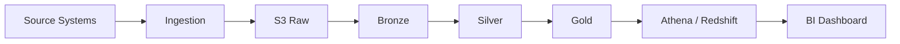

# Architecture

ที่มา: `Proposal - COM7 Internal Data Lake.pdf` v1 (4 ส.ค. 2026) + บันทึกออกแบบของทีม

---

## ภาพรวม



---

## AWS Target Architecture

ผู้จัดทำ proposal: Nartbodee Ariyasirichart (Tor), Solution Architect · Postsatorn Banlengjai (PJ), Account Executive

### ขนาดที่ proposal ระบุ

| | |
|---|---|
| Lake storage | **30 TB** แบ่งเป็น Bronze / Silver / Gold |
| ข้อมูลเข้า | **~50 GB/วัน** |
| ข้อมูลออก (query, analytics) | **~1 TB/วัน** |
| Pipeline | **~30 เส้น** |
| ครอบคลุม | Migrate → ETL → Store → Query → Analyze → AI (ทางเลือก) |

ผลลัพธ์ที่ proposal ระบุ: single source of truth ทั้งกลุ่ม · reporting และ analytics เร็วขึ้น · governance และ security สม่ำเสมอ · ปลดล็อก AI/BI

### Region

- Storage, ingestion, transformation, analytics อยู่ที่ **ap-southeast-7 (Thailand)**
- AI และ visualization บางตัว **คิดเงินจาก us-east-1**

บรรทัดที่สองเป็นต้นเหตุปัญหา performance ที่วัดได้จริง → [[../7 Reference/Athena Benchmark|Athena Benchmark]]

### แหล่งข้อมูล

| Domain               | ส่งอะไร                    | เชื่อมยังไง (ตาม proposal)                     |
| -------------------- | -------------------------- | ---------------------------------------------- |
| COM7 Data Center     | Batch CSV, REST API `/GET` | Site-to-Site VPN **30 encrypted tunnels**      |
| Other Cloud Provider | Batch CSV, Database        | SFTP (2 แบบ auth) replicate ผ่าน VPN + TLS/SSL |

> ⚠️ **แนวทางการเชื่อมต่อเปลี่ยนแล้ว** — ประชุม 24 ส.ค. 2026 สรุปว่าจะต่อผ่าน **VPN Client โดย Vanguard** แทน Site-to-Site VPN
> ส่วนที่เหลือของ proposal ยังไม่มีข้อมูลว่าเปลี่ยนตามหรือไม่ → [[Status & Phases]] · [[Decisions]] D-12

### Ingestion 3 เส้นทาง

**Path A — Streaming** · COM7 ยิงเข้า API `/POST` ที่มี WAF ป้องกัน → Kinesis Data Firehose → landing zone
คู่กับ Lambda ที่ EventBridge trigger ตามตาราง เพื่อดึงจาก REST API `/GET`

**Path B — SFTP** · Transfer Family ผ่าน VPC Endpoint → ลงถังโดยตรง

**Path C — Database CDC** · AWS DMS replicate แบบ near-real-time

ตัวเลือกสำรองที่ proposal ระบุ: Glue Crawler, MWAA, AppFlow, DataSync, Amazon MSK, Airbyte

### Zone ใน S3

| Zone               | Proposal เขียนว่า                    |
| ------------------ | ------------------------------------ |
| RAW (Unscan)       | landing zone มี lifecycle ลบทุกวัน   |
| quarantine-bucket  | ที่พัก object ระหว่าง scan malware   |
| RAW (Bronze)       | raw ที่ผ่าน scan แล้ว                |
| Clean (Silver)     | ข้อมูลที่ clean และ standardize แล้ว |
| Optional S3 (Gold) | ข้อมูลพร้อมใช้ทำ BI                  |

ทุกถังเปิด Block Public Access, Bucket Policies, Versioning

### Malware scanning

GuardDuty (Malware Protection for S3) สแกน object → EventBridge → Step Functions → SNS
ข้อมูลสะอาดขึ้น Bronze ข้อมูลติดเชื้อค้างใน quarantine

**Amazon Macie** อยู่ในแผนแต่ **ยังไม่เปิดใน ap-southeast-7** proposal ระบุว่าถ้าจะใช้ต้อง replicate ข้อมูลไป Singapore หรือรอเปิดบริการ

### Transformation และ Query

- **Glue ETL (Spark)** แปลงข้อมูลระหว่าง zone
- **Glue Data Catalog** เป็น metadata กลาง — proposal ระบุว่า *"Both Amazon Athena and Amazon Redshift READ table definitions from the Catalog"*
- **Athena** serverless SQL · **Redshift Serverless** เป็น data warehouse
- ทั้งคู่รันใน VPC

### Security

KMS (encryption at rest) · IAM + MFA · CloudTrail · CloudWatch · WAF · Secrets Manager · VPC PrivateLink · Resource Access Manager

**ไม่มี AWS Lake Formation ใน proposal** — เป็นช่องว่างที่ระบุไว้ ดู [[Open Questions & Risks]]

### Scope of Work

**PoC:** ออกแบบสถาปัตยกรรม → สร้าง PoC จริง → hands-on กับทีม COM7 → knowledge transfer → **สร้าง sample pipeline 1–2 เส้นเป็นตัวอย่าง**

proposal **ไม่มี section Timeline และ Pricing** อยู่ในไฟล์แยก

---

## นิยาม Bronze / Silver / Gold

**สถานะ: ยังไม่ตกลงกัน** — เป็น PoC issue ข้อ 3

> "ปัจจุบันยังไม่ได้กำหนด Definition ของแต่ละ Layer / Bucket อย่างชัดเจน ทำให้ยังไม่สามารถออกแบบ Glue Job ได้เหมาะสม"

### ที่ทีมร่างไว้

**Raw** — เก็บข้อมูลที่ ingest มาให้ใกล้เคียงต้นฉบับที่สุด ไม่ลบไม่แก้ ใช้เป็นจุดอ้างอิง

**Raw → Bronze** — scan malware (ไม่ผ่านไป quarantine) · ตัด column ที่ไม่ใช้ · schema normalization · แก้ data type · เปลี่ยนชื่อ table/column เป็นมาตรฐานองค์กร · เช็ค duplicate

**Bronze → Silver** — Data Quality · deduplication · standardization · จัดการ null/invalid · เช็ค business rule (อายุห้ามติดลบ ราคาห้ามน้อยกว่า 0) ผิดให้ flag หรือส่ง quarantine · แปลง type · จัด format (โทร `+66XXXXXXXXX`, วันที่ `YYYY-MM-DD`) · trim ช่องว่าง · standardize categorical (`M`/`Male`/`ชาย` → `M`) · แก้ encoding เป็น UTF-8 · แปลงเป็น Parquet/Iceberg + partition

**Silver → Gold** — join หลาย table · aggregate · feature engineering · one-hot encoding · จัด field ให้ตรง business requirement

### ข้อขัดแย้งที่ยังไม่ปิด

| | ทีมร่างไว้ | AWS Proposal |
|---|---|---|
| Bronze | รวม schema normalization + rename ด้วย | "raw ที่ผ่าน scan แล้ว" — แปลงน้อยกว่า |
| Quarantine | ปลายทางของข้อมูลที่ถูก reject | ที่พักระหว่าง scan malware |
| Gold | เป็น layer ปกติ | ทำเครื่องหมาย optional |

**ต้องปิดก่อนออกแบบ Glue job** → [[Open Questions & Risks]]

---

## Glue Job — การทดลองที่ยังไม่ทำ

เปรียบเทียบ 2 แบบ: job เดียวทำทั้งหมด vs แยก job ตาม layer
วัดที่ Runtime, Data scanned, Compute usage, Cost, Failure recovery

ข้อคิดจากบันทึกทีม:

> "AWS Glue ETL Jobs มีค่าใช้จ่ายตาม Compute Resources และ Runtime ที่ใช้ ... ดังนั้นการแยก Job ไม่ได้แปลว่าจะประหยัดเงินเสมอไป"
> "ลดปริมาณข้อมูลที่ต้องอ่านและประมวลผลในแต่ละขั้นตอน และเลือก Compute ให้เหมาะกับ Workload"

---

## S3 Strategy

**สถานะ: ยังไม่ตัดสินใจ** — PoC issue ข้อ 5

> "เบื้องต้น พบว่ายังไม่ได้วางแผนกำหนด S3 Bucket Structure และ Data Placement Strategy อย่างชัดเจน"

### ข้อเท็จจริงเรื่อง Region และ AZ

จากบันทึกทีม:
- เลือก Region ได้ แต่ S3 Standard **เลือก Availability Zone เองไม่ได้**
- S3 เก็บข้อมูลแบบ redundant ข้าม **อย่างน้อย 3 AZ ใน Region เดียวกัน**
- S3 Standard durability **99.999999999% (11 nines)** · availability 99.99%
- AZ ล่มยังรอด แต่ **Region ล่มไม่รอด** ต้องใช้ Cross-Region Replication

### Cross-Region Replication

Replicate แบบ asynchronous กำหนดทั้งถังหรือเลือกด้วย Prefix/Tag ได้

ข้อเสียที่ทีมบันทึก: storage cost คูณ 2 · ค่า transfer ระหว่าง region · async จึงต้องคิด RPO · ต้องออกแบบ failover/failback · ต้องจัดการ IAM และ policy สองฝั่ง

จุดยืนเบื้องต้น: *"ข้อมูลของ COM7 อาจไม่ต้อง CRR ก็ได้"*

### Storage Class — ข้อควรระวัง

> "Storage Class ต้องพิจารณาดีๆ ไม่ควรเลือก Glacier เพียงเพราะเป็นข้อมูลเก่า เพราะ Glacier มี Retrieval Cost และระยะเวลาขั้นต่ำในการจัดเก็บในบาง Storage Class"

### Partitioning

โครงสร้างที่ทีมยกตัวอย่าง:

```
sales/
  year=2026/
    month=03/
```

**วัดจริงจาก 45 query:** กรอง 1 partition เทียบกับ full scan → เร็วขึ้น 8–9 เท่า และ scan น้อยลง 94%
Athena คิดเงินตาม TB ที่ scan จึงลด cost ในสัดส่วนเดียวกัน

กฎที่ทีมบันทึก:
- Partition บน column ที่ใช้ใน `WHERE` จริง — สำรวจ query pattern ก่อน
- ไม่ควร partition ทุก table — dataset เล็กหรือที่ต้องอ่านทั้งหมดไม่ได้ประโยชน์
- ไม่ควรละเอียดเกิน — *"ควรแบ่งแค่ต่ำสุด month ก็พอ"*

### งานที่ต้องทำ

- สำรวจและจัดประเภทข้อมูลทั้งหมด
- จัดลำดับความสำคัญ Critical / Important / Normal
- กำหนด retention period ต่อ dataset
- ประเมิน dataset ที่ต้องทำ Multi-Region
- ประเมิน storage class ที่เหมาะกับแต่ละ dataset
- ประเมิน cost

งาน classification ชุดนี้ตอบได้ทั้ง storage class, replication และขอบเขตการ scan malware พร้อมกัน `[อนุมาน]`

---

## Layer ที่ยังไม่มี

| Layer | สถานะ |
|---|---|
| Ingestion | ออกแบบแล้ว **ยังไม่ทดสอบกับ database จริง** |
| Raw | ตกลงแล้ว |
| Bronze / Silver | เส้นแบ่งยังขัดกัน |
| Gold | proposal ทำเครื่องหมาย optional |
| Identity Resolution | **ไม่มี** (Gap Review `ARC-02`) |
| Customer 360 / CDP | **ไม่นิยาม** (Gap Review `ARC-01`) |
| Activation | มีแค่ Braze |
| Governance | ขาดเกือบทั้งหมด |

ช่องว่างสำคัญที่สุดคือ **ไม่มี layer รวมข้อมูลลูกค้าระหว่าง source system กับ Braze** → [[../4 SSOT & Customer 360/Customer Identity|Customer Identity]]

---

## อ่านต่อ

[[../1 Data Framework/Objectives & SSOT Roadmap|Objectives & SSOT Roadmap]] · [[Status & Phases]] · [[Decisions]] · [[../6 Technical/AWS Services|AWS Services]] · [[../6 Technical/ETL & Spark|ETL & Spark]]
